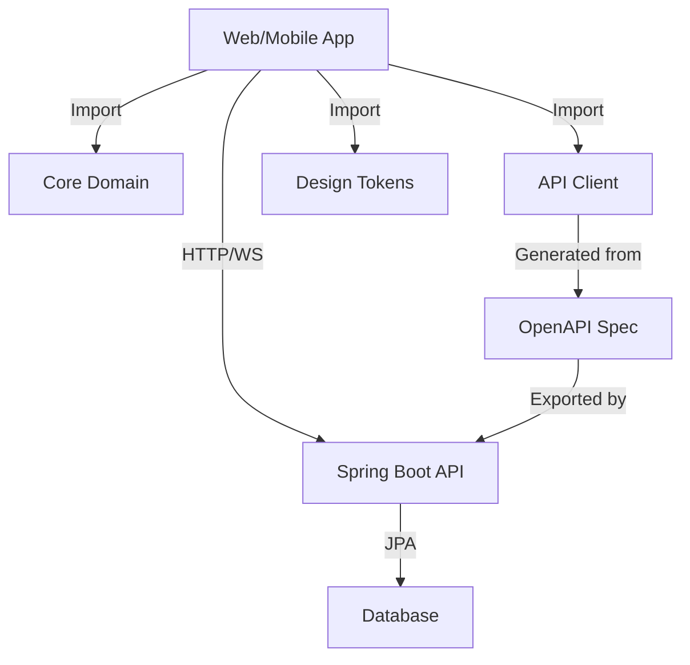

# Architecture Overview

This document outlines the high-level architecture of the Drimain monorepo system.

## System Architecture

```
┌─────────────────────────────────────────────────────────────┐
│                    Drimain Monorepo                        │
├─────────────────────────────────────────────────────────────┤
│  Apps                    │  Packages                        │
│  ├── web (React/Next.js) │  ├── core-domain               │
│  └── mobile (RN/Expo)    │  ├── api-client                │
│                          │  └── design-tokens             │
└─────────────────────────────────────────────────────────────┘
                           │
                           ▼
                ┌─────────────────────┐
                │   Java Backend      │
                │  (Spring Boot)      │
                │  ├── REST API       │
                │  ├── WebSocket      │
                │  ├── Authentication │
                │  └── Database       │
                └─────────────────────┘
```

## Components

### Applications (apps/)

#### Web Application

- **Technology**: React with Next.js
- **Purpose**: Full-featured web interface
- **Target**: Desktop and tablet users
- **Features**: Admin dashboard, bulk operations, data visualization

#### Mobile Application

- **Technology**: React Native with Expo
- **Purpose**: Mobile-first experience
- **Target**: Field workers, mobile users
- **Features**: Offline capabilities, push notifications, camera integration

### Shared Packages (packages/)

#### Core Domain (`@drimain/core-domain`)

- **Purpose**: Shared business logic and types
- **Contents**:
  - TypeScript interfaces and types
  - Domain models (User, Part, Machine, etc.)
  - Data mappers and transformers
  - Validation schemas (Zod)
  - Business rules and constants

#### API Client (`@drimain/api-client`)

- **Purpose**: Type-safe API communication
- **Contents**:
  - Generated TypeScript client from OpenAPI
  - Request/response types
  - Error handling utilities
  - Authentication helpers

#### Design Tokens (`@drimain/design-tokens`)

- **Purpose**: Unified design system
- **Contents**:
  - Colors, typography, spacing
  - Component tokens
  - Platform-specific outputs (CSS vars, JS objects)
  - Theme configurations

### Backend (Java Spring Boot)

- **Current Implementation**: Fully functional API
- **Technology**: Java 17 + Spring Boot 3.2.5
- **Database**: H2 (development), configurable for production
- **Authentication**: JWT with Spring Security
- **API Documentation**: SpringDoc OpenAPI

## Data Flow



## Development Workflow

1. **Backend First**: Define API contracts in Spring Boot
2. **Generate Client**: Auto-generate TypeScript client from OpenAPI
3. **Domain Modeling**: Update shared types in core-domain
4. **Verification**: Run model sync validation
5. **UI Implementation**: Build features in web/mobile apps

## Technology Stack

### Frontend Stack

- **Language**: TypeScript
- **Web Framework**: React + Next.js
- **Mobile Framework**: React Native + Expo
- **State Management**: TBD (Context/Zustand/Redux)
- **Styling**: TBD (Tailwind/Styled-components/Emotion)
- **Testing**: Vitest/Jest + React Testing Library

### Backend Stack

- **Language**: Java 17
- **Framework**: Spring Boot 3.2.5
- **Security**: Spring Security + JWT
- **Database**: JPA/Hibernate
- **Documentation**: SpringDoc OpenAPI
- **Testing**: JUnit + TestNG

### DevOps Stack

- **Monorepo**: Turbo + pnpm workspaces
- **Linting**: ESLint + TypeScript ESLint
- **Formatting**: Prettier
- **Git Hooks**: Husky + lint-staged
- **CI/CD**: GitHub Actions
- **Versioning**: Conventional Commits + Standard Version

## Security Considerations

1. **Authentication**: JWT-based with refresh tokens
2. **Authorization**: Role-based access control (RBAC)
3. **API Security**: CORS, rate limiting, input validation
4. **Data Protection**: Sensitive data encryption
5. **Mobile Security**: Secure storage, certificate pinning

## Scalability Strategy

1. **Horizontal Scaling**: Load balancers, multiple backend instances
2. **Database Scaling**: Read replicas, connection pooling
3. **Caching**: Redis for sessions and frequently accessed data
4. **CDN**: Static asset delivery
5. **Microservices**: Future migration path from monolith

## Monitoring & Observability

1. **Logging**: Structured logging with correlation IDs
2. **Metrics**: Application and business metrics
3. **Tracing**: Distributed tracing for performance
4. **Health Checks**: Application and dependency health
5. **Alerting**: Proactive issue detection

## Migration Strategy

The current architecture supports gradual migration:

1. **Phase 1**: Monorepo setup (current)
2. **Phase 2**: Web app integration with existing backend
3. **Phase 3**: Mobile app development
4. **Phase 4**: Feature parity and optimization
5. **Phase 5**: Advanced features and scaling

---

_This document will be updated as the architecture evolves._
